# Spotify SQL Analysis

## 📌 Project Overview

This project focuses on analyzing Spotify track data using **SQL**. The analysis progresses from basic filtering and aggregation to advanced techniques such as **CTEs, subqueries, conditional aggregation, and window functions**.

The analysis explores tracks, artists, albums, streams, views, likes, comments, and audio characteristics through a series of analytical questions.

---

## 🎯 Objectives

* Practice SQL querying on a real-world-style music dataset.
* Analyze track, album, and artist performance.
* Compare Spotify and YouTube streaming performance.
* Practice aggregation and conditional analysis.
* Apply CTEs, subqueries, and window functions to solve analytical problems.
* Strengthen practical SQL skills for data analysis.

---

## 🗂️ Dataset

The dataset contains Spotify-related information for tracks, including:

* Track name
* Artist
* Album
* Album type
* Streams
* Views
* Likes
* Comments
* Danceability
* Energy
* Liveness
* Official video status
* License status
* Most-played platform

---

# 🔍 SQL Analysis

## 🟢 Easy Level

### 1. Retrieve the names of all tracks that have more than 1 billion streams.

```sql
SELECT track
FROM spotify
WHERE stream > 1000000000;
```
__OUTPUT:__ 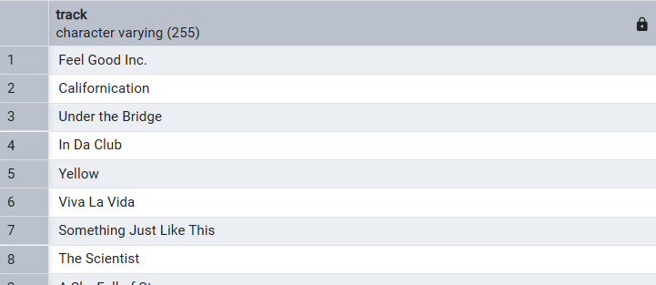
### 2. List all albums along with their respective artists.

```sql
SELECT DISTINCT album, artist
FROM spotify;
```
__OUTPUT:__ 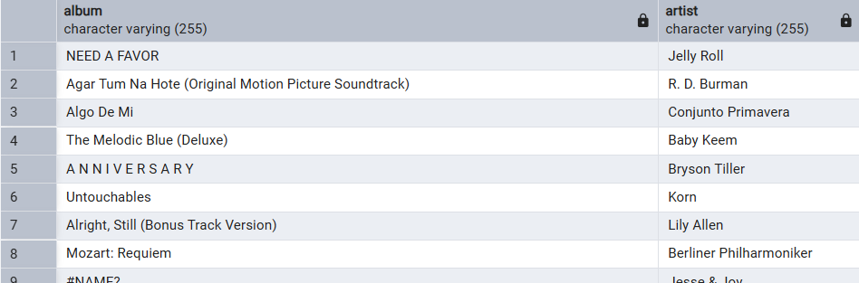

### 3. Get the total number of comments for tracks where `licensed = TRUE`.

```sql
SELECT SUM(comments) AS total_comments
FROM spotify
WHERE licensed = 'true';
```
__OUTPUT:__ 

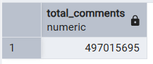

### 4. Find all tracks that belong to the album type `single`.

```sql
SELECT *
FROM spotify
WHERE album_type = 'single';
```
__OUTPUT:__ 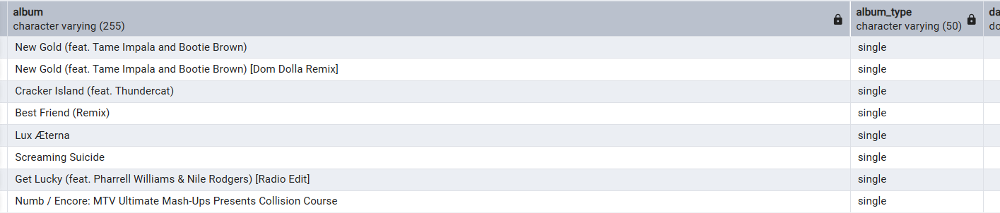

### 5. Count the total number of tracks by each artist.

```sql
SELECT artist,
       COUNT(*) AS total_no_of_songs
FROM spotify
GROUP BY artist
ORDER BY total_no_of_songs DESC;
```
__OUTPUT:__ 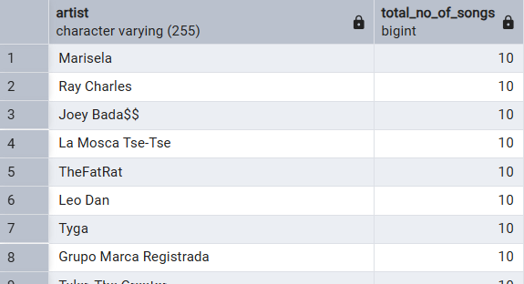

---

## 🟡 Medium Level

### 6. Calculate the average danceability of tracks in each album.

```sql
SELECT album,
       AVG(danceability) AS average_danceability
FROM spotify
GROUP BY album
ORDER BY average_danceability DESC;
```
__OUTPUT:__ 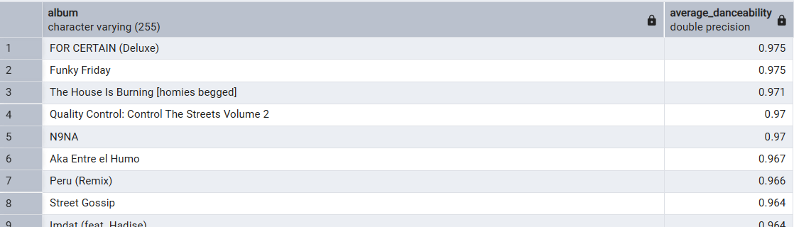

### 7. Find the top 5 tracks with the highest energy values.

```sql
SELECT track,
       MAX(energy) AS highest_energy
FROM spotify
GROUP BY track
ORDER BY highest_energy DESC
LIMIT 5;
```
__OUTPUT:__ 

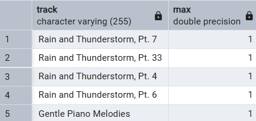

### 8. List all tracks along with their views and likes where `official_video = TRUE`.

```sql
SELECT track,
       SUM(views) AS total_views,
       SUM(likes) AS total_likes
FROM spotify
WHERE official_video = 'true'
GROUP BY track
ORDER BY total_views DESC;
```
__OUTPUT:__ 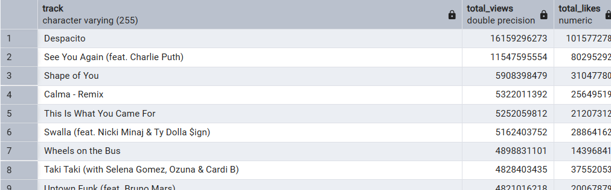

### 9. For each album, calculate the total views of all associated tracks.

```sql
SELECT album,
       SUM(views) AS total_views
FROM spotify
GROUP BY album
ORDER BY total_views DESC;
```
__OUTPUT:__ 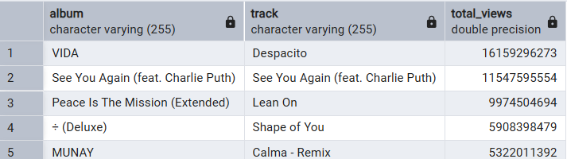

### 10. Retrieve the track names that have been streamed on Spotify more than YouTube.

```sql
SELECT *
FROM
(
    SELECT track,
           COALESCE(
               SUM(CASE
                   WHEN most_played_on = 'Youtube' THEN stream
               END), 0
           ) AS streamed_on_youtube,

           COALESCE(
               SUM(CASE
                   WHEN most_played_on = 'Spotify' THEN stream
               END), 0
           ) AS streamed_on_spotify

    FROM spotify
    GROUP BY track
) AS spotify_stream_type

WHERE streamed_on_youtube < streamed_on_spotify
  AND streamed_on_youtube <> 0

ORDER BY streamed_on_spotify DESC;
```
__OUTPUT:__ 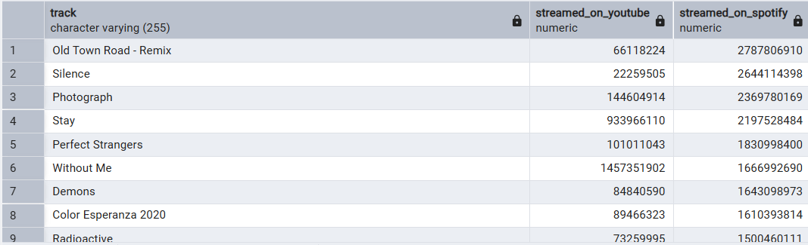

---

## 🔴 Advanced Level

### 11. Find the top 3 most-viewed tracks for each artist using window functions.

```sql
WITH ranking_artist AS
(
    SELECT artist,
           track,
           SUM(views) AS total_views,
           DENSE_RANK() OVER (
               PARTITION BY artist
               ORDER BY SUM(views) DESC
           ) AS ranking
    FROM spotify
    GROUP BY artist, track
)

SELECT *
FROM ranking_artist
WHERE ranking <= 3;
```
__OUTPUT:__ 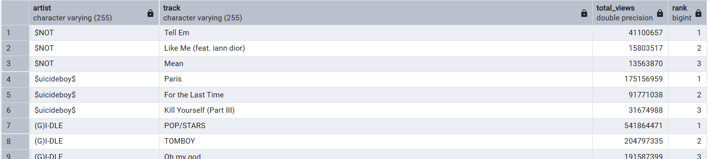

### 12. Find tracks where the liveness score is above the average.

```sql
SELECT track,
       artist,
       liveness
FROM spotify
WHERE liveness > (
    SELECT AVG(liveness)
    FROM spotify
);
```
__OUTPUT:__ 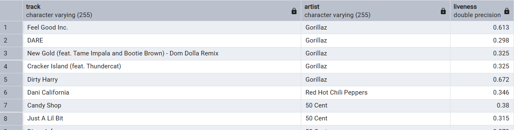

### 13. Calculate the difference between the highest and lowest energy values for tracks in each album.

```sql
WITH cal_energy AS
(
    SELECT track,
           album,
           MAX(energy) AS highest_energy,
           MIN(energy) AS lowest_energy
    FROM spotify
    GROUP BY track, album
)

SELECT track,
       album,
       highest_energy - lowest_energy AS calculated_difference
FROM cal_energy
ORDER BY calculated_difference DESC;
```
__OUTPUT:__ 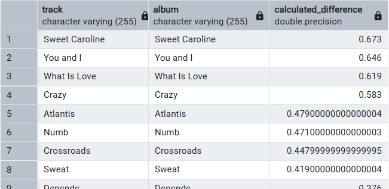

### 14. Find tracks where the energy-to-liveness ratio is greater than 1.2.

```sql
SELECT track,
       energy / liveness AS energy_liveness_ratio
FROM spotify
WHERE energy / liveness > 1.2
ORDER BY energy_liveness_ratio;
```
__OUTPUT:__ 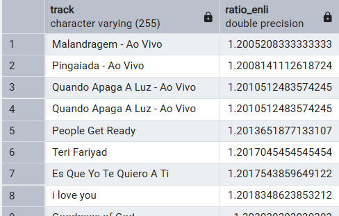

### 15. Calculate the cumulative sum of likes for tracks ordered by the number of views.

```sql
SELECT track,
       views,
       likes,
       SUM(likes) OVER (
           ORDER BY views DESC
       ) AS cumulative_sum_likes
FROM spotify
GROUP BY track, views, likes
ORDER BY views DESC;
```
__OUTPUT:__ 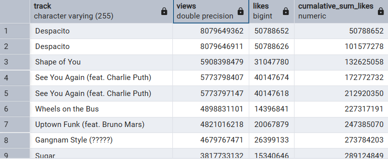

---

## 🛠️ SQL Concepts Practiced

This project covers:

* `SELECT`
* `WHERE`
* `DISTINCT`
* `GROUP BY`
* `ORDER BY`
* `LIMIT`
* `SUM()`
* `AVG()`
* `COUNT()`
* `MAX()`
* `MIN()`
* `CASE WHEN`
* `COALESCE()`
* Subqueries
* Common Table Expressions (`WITH`)
* Window functions
* `DENSE_RANK()`
* Conditional aggregation
* Ratio calculations
* Cumulative aggregations

---

## 📊 Key Analytical Areas

### Track Performance

* Streams
* Views
* Likes
* Comments

### Artist Performance

* Number of tracks
* Most-viewed tracks
* Track rankings

### Album Analysis

* Average danceability
* Total views
* Energy characteristics

### Platform Comparison

* Spotify vs. YouTube streaming performance

### Audio Characteristics

* Energy
* Danceability
* Liveness

---

## 📁 Project Structure

```text
Spotify-SQL-Analysis/
│
├── README.md
├── 1_spotify_analysis.sql
├── 2_spotify_analysis.sql
├── 3_spotify_analysis.sql
└── data/
    └── cleaned_dataset.csv
```

---

## 💡 What I Learned

Through this project, I strengthened my ability to translate analytical questions into SQL queries and progressively moved from basic queries to more advanced analytical techniques.

The project particularly helped me understand how **subqueries, CTEs, conditional aggregation, and window functions** can be used to solve practical data-analysis problems.

---

## 🏁 Conclusion

This project demonstrates practical SQL skills through a structured analysis of Spotify track data. It covers the progression from basic data retrieval and aggregation to advanced analytical queries using CTEs and window functions.

The project was created as a **SQL learning and portfolio project**, with an emphasis on writing queries that answer practical analytical questions.
